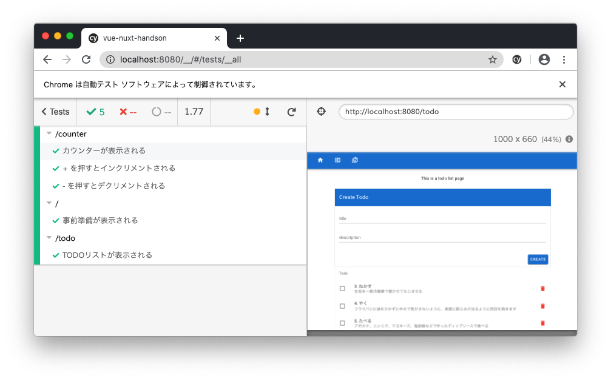
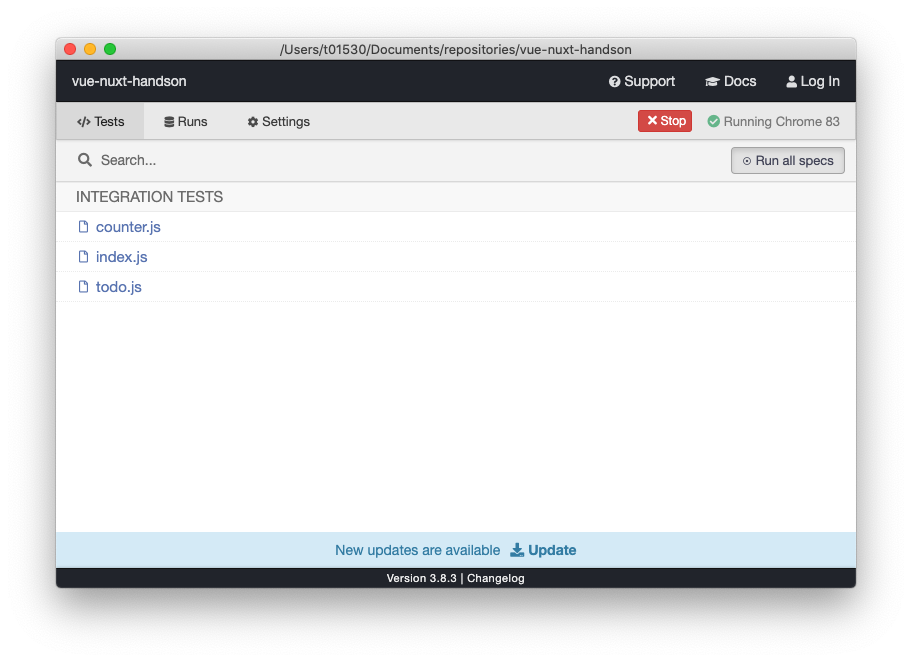

autoscale: true
slidenumbers: true
text: #ffffff, alignment(left), line-height(0), text-scale(1.0), Avenir Next Bold
header: #ffffff, alignment(left), line-height(0), text-scale(1.5), Avenir Next Bold
footer-style: #ffffff, alignment(left), line-height(0), text-scale(1.0), Avenir Next Bold
list: #ffffff, bullet-character(・)

# Vue.jsについて


---

# Vue.jsとは

- Javascriptのフレームワーク
- コンポーネント志向
- Angularのようなtemplate syntaxでReactのような機能範囲
- 日本語ドキュメント含めて充実
- 比較的学習コスト控えめ
- 国内ではzozo、line、dmm。国外ではalibaba、baidu等
- 東京都コロナ対策サイト https://github.com/tokyo-metropolitan-gov/covid19

---

# 他のフレームワークは？

- Vue
  - コミュニティで成長するView側の機能を提供する日本で一番人気な小~中規模向けフレームワーク
- React
  - Facebookが開発するView側の機能を提供する世界で一番人気な中規模向けフレームワーク
- Angular
  - Googleが開発するテンプレートやルーター、HttpClientなど幅広くサポートする大規模向けフレームワーク

https://trends.google.co.jp/trends/explore?q=vue,angular,react

---

# セットアップ方法

```sh
$ vue create {project name}
? Please pick a preset
  Manually select features
? Check the features needed for your project
❯ ◉ Babel
  ◉ TypeScript
  ◉ Progressive Web App (PWA) Support
  ◉ Router
  ◉ Vuex
  ◉ CSS Pre-processors
  ◉ Linter / Formatter
  ◉ Unit Testing
  ◉ E2E Testing
```

---

```sh
? Use class-style component syntax?
  Yes
? Use Babel alongside TypeScript (required for modern mode, auto-detected polyfills, transpiling JSX)?
  Yes
? Pick a CSS pre-processor (PostCSS, Autoprefixer and CSS Modules are supported by default):
  Sass/SCSS (with dart-sass)
  Sass/SCSS (with node-sass)
  Less
  ❯ Stylus
? Pick a linter / formatter config: (Use arrow keys)
  ESLint with error prevention only
❯ ESLint + Airbnb config
  ESLint + Standard config
  ESLint + Prettier
  TSLint (deprecated)
```

---


```sh
? Pick additional lint features:
❯◉ Lint on save
 ◯ Lint and fix on commit
? Pick a unit testing solution: (Use arrow keys)
  Mocha + Chai
❯ Jest
? Pick an E2E testing solution
❯ Cypress (Chrome only)
  Nightwatch (WebDriver-based)
? Where do you prefer placing config for Babel, ESLint, etc.? (Use arrow keys)
❯ In dedicated config files
  In package.json
? Save this as a preset for future projects? (y/N)
  Yes
```

---

# 主なツールセット

- Babel トランスパイルに必要
- TypeScript AltJS
- VueRouter SPA化するためのルーティングライブラリ
- Vuex 状態管理
- ESLint+AirbnbConfig 静的解析
- Stylus AltCSS
- Jest ユニットテスト
- Cypress E2Eテスト
- Vuetify CSSフレームワーク

---

# フォルダ構成と重要なファイルをみてみよう

- src/router/index.ts SPAにするためのルーティング定義
- src/views ルーティング毎の1番上位のコンポーネントをここに置く
- src/components コンポーネント置き場 分解したUIパーツをここに置く
- src/store 状態やイベントを受け取ってviewを変更するためのロジックを置く

---

# コンポーネントの書き方

---

# コンポーネントの書き方

`<template>` や `<style>` や `<script>` などのタグを書いてコンポーネントの見た目や動作を定義します。

ひとつずつみていきましょう。

---

# templateタグ

templateタグを書く事でhtmlを書く事ができます。

```html
<template>
  <v-card>hello</v-card>
</template>
```

---

# templateタグ

今回はvuetifyというCSSフレームワークを利用しているので生のhtmlを書くより効率的に良いUIを作れます。

必要なら以下からコンポーネントを調べて利用しましょう。

https://vuetifyjs.com/ja/components/cards/

---

# template syntax

template内に埋め込まれるタグは独自のシンタックスを持ちます。

変数展開や便利な属性があるので一部みてみましょう。

---

# 展開

`{{}}` で後に説明するstoreの値を展開する事ができます。

また、計算や関数の実行も可能です。

https://jp.vuejs.org/v2/guide/syntax.html#ディレクティブ

```html
<template>
  <div>
    <v-card>{{count}}</v-card>
    <v-card>{{count + 1}}</v-card>
  </div>
</template>
```

---

# v-if

`v-if` でstoreの値を元に条件付きレンダリングができます。

https://jp.vuejs.org/v2/guide/conditional.html

```html
<template>
  <div v-if="show"></div>
</template>
```

---

# v-for

`v-for` でstoreの値(配列)をループしてレンダリングができます。

https://jp.vuejs.org/v2/guide/list.html

```html
<template>
  <ul>
    <li v-for="item in items" :key="item.message">
      {{ item.message }}
    </li>
  </ul>
</template>
```

---

# v-on

`v-on` でイベント発火でstoreのメソッドを呼び出す事ができます。

また、糖衣構文として `@click` も同じ動作をします。

https://jp.vuejs.org/v2/guide/events.html

```html
<template>
  <div>
    <v-btn v-on:click="onClick"></v-btn>
    <v-btn @click="onClick"></v-btn>
  </div>
</template>
```

---

他にもstoreとつなげるためのいろいろな属性があります。

- `v-bind` https://jp.vuejs.org/v2/guide/class-and-style.html
- `v-model` https://jp.vuejs.org/v2/guide/forms.html

---

# styleタグ

styleタグを書く事でcssを書く事ができます。

```html
<template>
  <v-card class="bg-red">red card</v-card>
</template>

<style lang="stylus">
.bg-red
  background-color red
</style>
```

---

# styleタグ

今回はstylusというAltCSSを利用しているので、効率的にCSSを書く事ができます。

変数などの構文以外はCSSやSASSの構文でも動作しますが、必要なら利用しましょう。

https://stylus-lang.com/

---

# styleタグ

コンポーネントのstyleは外部に漏れないため、命名はそのtemplate内だけのスコープで問題ありません。

---

# scriptタグ

scriptタグでコンポーネントの動作を定義します。

ひとつづつみていきましょう

---

```html
<script>
import store from '@/store/HandCounterStore';
import Title from '@/components/Title.vue';

export default {
  name: 'counter',
  store,
  components: {
    Title,
  },
  props: {
    title: String,
  },
  computed: {
    count() {
      return this.$store.state.count;
    },
  },
  methods: {
    increment() {
      this.$store.dispatch('increment');
    },
  },
};
</script>
```

---

# components

template内で利用する独自で作成したコンポーネントを定義します。

template内で利用できるようになります。

```html
<template>
  <my-header/>
</template>

<script>
import MyHeader from '@/components/MyHeader.vue';

export default {
  components: {
    MyHeader,
  },
};
</script>
```

---

# props

propsで受け取る属性を定義します。

利用側は属性で渡し、受け取り側は変数展開などで利用できます。

```html
<template>
  <div>{{title}}</div>
</template>

<script>
export default {
  name: 'my-header',
  props: {
    title: String,
  },
};
</script>
```

```html
<template>
  <my-header title="hello"/>
</template>
```

---

# store

ここでStoreの概念が出てきます。

```html
<script>
import store from '@/store/HandCounterStore';

export default {
  name: 'counter',
  store,
};
</script>
```

---

Store(状態管理)が何か図でみてみましょう

---


---

今回のハンズオンレベルの規模にはデフォルトのvueの状態管理はぴったりです。

ただし開発規模が大きい(大きく)なるにつれて、テストのしやすさや複雑性回避のためにコンポーネントから状態管理を分離したくなります。

> Vuex は、共有状態の管理に役立ちますが、さらに概念やボイラープレートのコストがかかります。これは、短期的生産性と長期的生産性のトレードオフです。

https://vuex.vuejs.org/ja/

---

Vuexの状態管理の図もみてみましょう

---


---

今回はデフォルトの状態管理ではなくVuexの状態管理を学びます。

難しい概念ですが、後々入れておくべきだったと後悔する前に慣れておきましょう。

今はこういう書き方なのか程度の理解で問題ありません。

---

動画で学ぼう

https://player.vimeo.com/video/297516469?autoplay=1&app_id=122963

---

# store

後にvuexで定義したstoreをコンポーネントに適用します。

これにより、イベントを受け取るメソッド内で `this.$store` でstoreにアクセスできるようになります

```html
<script>
import store from '@/store/HandCounterStore';

export default {
  name: 'counter',
  store,
};
</script>
```

---

# computed

`computed` でストアの値を返します。これによりテンプレートで利用できるようになります。

```html
<template>
  <div>{{count}}</div>
</template>

<script>
export default {
  computed: {
    count() {
      return this.$store.state.count;
    },
  },
};
</script>
```

---

# methods

`methods` でクリックなどのイベントが発火した際の動作を定義します。

先ほどの概念図にもありましたが、コンポーネントからは `dispatch` 経由で処理しましょう。

```html
<script>
export default {
  methods: {
    increment() {
      this.$store.dispatch('increment');
    },
  },
};
</script>
```

---

# storeの書き方

---

# storeの書き方

Vueデフォルトの状態管理 `data` `methods` `computed` に変わる

Vuexの状態管理 `state` `mutations` `actions` `getters` を定義します。

それぞれみていきましょう。

---

```ts
import Vue from 'vue';
import Vuex from 'vuex';

Vue.use(Vuex);

export default new Vuex.Store({
  state: {
    count: 0,
  },
  mutations: {
    increment: (state) => {
      state.count += 1;
    },
  },
  actions: {
    increment: (context) => {
      context.commit('increment');
    },
  },
});
```

---

# state

`state` で状態を定義します。これは画面を動的に変える為の変数を定義すると考えて問題ないです。

```ts
export default new Vuex.Store({
  state: {
    count: 0,
  },
});
```

---

# actions

`actions` で状態の変更を `mutation` に伝えます。

```ts
export default new Vuex.Store({
  actions: {
    increment: (context) => {
      context.commit('increment');
    },
  },
});
```

---

# mutations

`mutations` で状態を変更する処理を書きます。

```ts
export default new Vuex.Store({
  mutations: {
    increment: (state) => {
      state.count += 1;
    },
  },
});
```

---

# actionsとmutationsの違い

実際にはコンポーネントから直接 `mutations` へ `commit` する事も可能ですが、

公式で非推奨でデバッガにも影響がでるのでなるべく従うようにしよう。

- `actions`
  - `mutations` へ `commit` する
  - Backend APIへリクエストを送り、ローディングフラグを操作するなど非同期処理も可能
- `mutations`
  - 同期処理のみ。実際に値を更新し、(自動的に)再レンダリングする
  - dev toolとも連携してデバッグを容易にする

---

# テスト

---

# テスト

巨大なプロジェクトになるほど品質は重要になります。

品質を維持するための `ユニットテスト` `E2Eテスト` `静的コード解析` についてもみていきましょう。

---

# ユニットテスト

ユニットテストにjestを利用しています。

使いやすい関数群に加え、変更を加えた事による影響を調べるリグレッションテストに有効なスナップショットテストなどかなり便利です。

- vue unit test https://jp.vuejs.org/v2/guide/unit-testing.html
- jest https://jestjs.io/docs/ja/getting-started
- jest snapshot test https://jestjs.io/docs/ja/snaps

---

# ユニットテスト

masterブランチで実行してみよう

```sh
$ git checkout master
$ yarn test:unit
```

---

# E2Eテスト

Chrome必須ですが、cypressというE2Eテストツールで実際のブラウザでの動作をテストできます。

https://docs.cypress.io/guides/overview/why-cypress.html#In-a-nutshell

---

# E2Eテスト

masterブランチで実行してみよう

```sh
$ git checkout master
$ yarn test:e2e
```

---



---



---

# 静的コード解析

静的コード解析に `eslint` を利用し、設定は `airbnb` を利用しています。

チーム開発時に個人の書き方の差を埋めてくれたり、良くない書き方をしている場合に注意してくれるのでかなり勉強になります。

- eslint https://eslint.org/
- eslint + airbnb config https://github.com/vuejs/eslint-config-airbnb

---

# 静的コード解析

masterブランチで実行してみよう

```sh
$ git checkout master
$ yarn lint
```

---

# ハローワールドしてみよう

---

# ハローワールドしてみよう

`setup-handson` タグをチェックアウトして実際の書き方調べながらハローワールドしよう。

```sh
$ git checkout refs/tags/setup-handson
```

`/helloworld` にアクセスすると `hello world!` という文字が表示されるページを作ってみましょう。

---

# まずはviewを作成します

`src/views/HelloWorld.vue`

```html
<template>
  <p>helloworld</p>
</template>

<script>
export default {
  name: 'helloworld',
};
</script>

```

---

# 作ったviewをrouterに登録します

`src/router/index.ts`

```diff
...
import Home from '../views/Home.vue';
+ import HelloWorld from '../views/HelloWorld.vue';
...
const routes: Array<RouteConfig> = [
  {
    path: '/',
    name: 'Home',
    component: Home,
  },
+ {
+   path: '/helloworld',
+   name: 'HelloWorld',
+   component: HelloWorld,
+ },
];
...
```

---

# /helloworld にアクセスする。

この時点で作ったviewがrouterに登録され、 `/helloworld` のパスで `hello world!` が表示された事が確認できると思います。

ヘッダメニューには登録されていないので `AppBar.vue` を修正してメニューに表示しましょう。

---

# AppBar.vue(ヘッダメニュー)に登録します

`src/components/AppBar.vue`

```diff
<template>
  <v-app-bar app color="primary" dark>
    <router-link to="/">
      <v-btn text>
        <v-icon>mdi-home</v-icon>
      </v-btn>
    </router-link>
+   <router-link to="/helloworld">
+     <v-btn text>
+       <v-icon>mdi-numeric-1-box-outline</v-icon>
+     </v-btn>
+   </router-link>
  </v-app-bar>
</template>
```

---

# いろいろいじったり調べたりしよう

- `hello world!` の文言変更してみよう
- routerいじってURLを変更してみよう
- v-btnってなんだろう
  - https://vuetifyjs.com/ja/components/buttons/
- v-iconってなんだろう。icon変更してみよう
  - https://materialdesignicons.com/ 登録されているicon名に `mdi-` をつけて `v-icon` タグで囲う
- AppBarはなぜ全ページで表示されるんだろう

---

# カウンターアプリを作ってみよう

---

# カウンターアプリ参考

- https://arakawamoriyuki-vue-nuxt-handson.vercel.app
- router https://github.com/arakawamoriyuki/vue-nuxt-handson/blob/counter/src/router/index.ts#L14-L18
- view https://github.com/arakawamoriyuki/vue-nuxt-handson/blob/counter/src/views/Counter.vue
- component https://github.com/arakawamoriyuki/vue-nuxt-handson/blob/counter/src/components/HandCounter.vue
- store https://github.com/arakawamoriyuki/vue-nuxt-handson/blob/counter/src/store/HandCounterStore.ts

---

# TODOリストアプリを作ってみよう

---

# TODOリストアプリを作ってみよう

`counter` タグをチェックアウトして実際の書き方調べながらTODOリストアプリを作ろう。

```sh
$ git checkout refs/tags/counter
```

---

# TODOリストアプリ参考

- https://arakawamoriyuki-vue-nuxt-handson.vercel.app

---

# プロフィールサイトを作ってみよう

---

# プロフィールサイトを作ってみよう

`todolist` タグをチェックアウトして実際の書き方調べながらプロフィールサイトを作ろう。

```sh
$ git checkout refs/tags/todolist
```

コンポーネントやルーティングも全部消して一から作ってOK！
