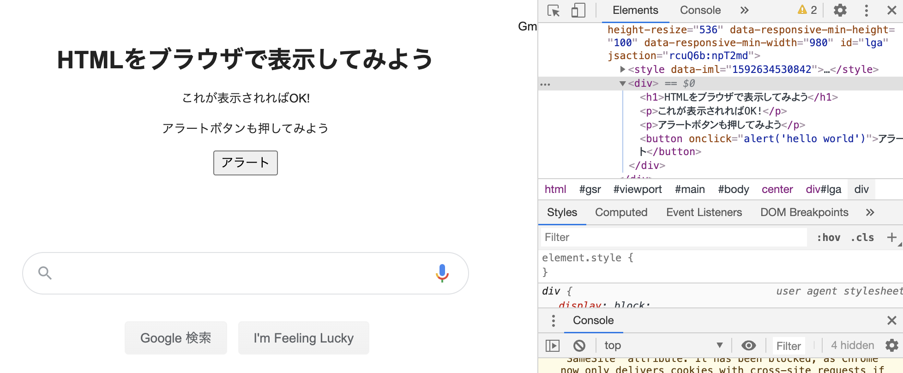
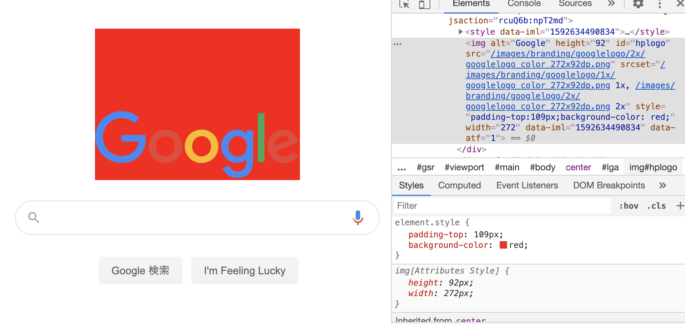
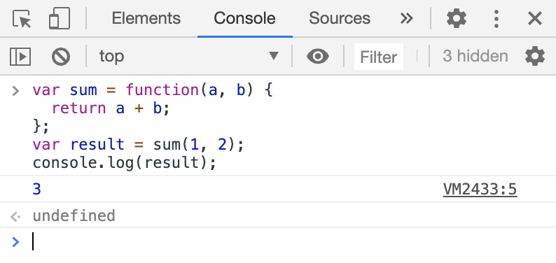

autoscale: true
slidenumbers: true
text: #ffffff, alignment(left), line-height(0), text-scale(1.0), Avenir Next Bold
header: #ffffff, alignment(left), line-height(0), text-scale(1.5), Avenir Next Bold
footer-style: #ffffff, alignment(left), line-height(0), text-scale(1.0), Avenir Next Bold
list: #ffffff, bullet-character(・)

# Web基礎


---

# Webって何かおさらい

- バックエンド
  - データベースと通信してブラウザに返したり
  - 適材適所で Ruby, Python, Node, PHP, Java, Go...
  - サーバーサイド、サーバー側の言語
- フロントエンド
  - ユーザーに近い見た目を構成する
  - 共通して HTML, CSS, Javascript
  - クライアントサイド、ブラウザで動く言語


---

# ハンズオンで主に学ぶもの

- フロントエンド クライアントサイド ブラウザ側
- 主にJavascript (TypeScriptを利用)
- フレームワークとして Vue.js


---

# フロントエンドって重要なの？

- HTML,CSSで綺麗な見た目のWebサイトなだけではダメなの？
- なぜフレームワークを使うの？

少しだけ歴史の話を

---

# 静的なHTMLから動的なHTMLへ

見るだけのWebサイトが生きたWebサイトになった

- Ajax (Google Map)
  - javascript側でリクエスト、結果を受け取ってページ遷移なくレンダリング
- jQuery
  - ボタンクリックやAjax処理など、簡単に書けるようになった
  - ただし大きくなるにつれ複雑になる為、angularjsなどに置き換わっていく

---

# デバイズや技術の進化

さらに豪華なUIでUX向上した

- WebGL
  - https://webglsamples.org/aquarium/aquarium.html
- AMP
  - キャッシュや非同期処理のみ許容など徹底した速度改善

---

# デバイズや技術の進化

- シングルページアプリケーション
  - 再読み込みがなくページ遷移のないアプリのようなWebページ
- データバインディング(リアクティブプログラミング)
  - angularjsの台頭でさらに簡単、かつルールのあるレンダリングが可能になった
    - https://www.w3schools.com/angular/tryit.asp?filename=try_ng_intro
  - 双方向データバインディングの重さやデータフローの明示性が問題になり単方向のreactや両対応のangular2やvue.jsが出てくる
  - 機能の分離や保守性の為にコンポーネント指向という概念も出てくる

---

# クロスプラットフォーム化

- Flutter, React Native, Xamarin
- Unity
- Monaca, PhoneGap

それぞれ違うけど

- Web技術をアプリに生かしたり
- 各プラットフォーム向けにビルド可能だったり
- Webサイト自体をアプリ化したり
- アプリをWebにビルドした例 https://worldflipper.jp/demo/

---

# Webサイトをアプリ化

- PWA アプリと同等を目指す機能群
  - push通知
  - オフラインモード
  - ホーム画面上でのアイコンの表示
  - カメラやマイク、センサー類、BluetoothやNFCなどハードウェアアクセス
- web assembly
  - ブラウザ上でバイナリを動作させる (Goなどでコンパイル)
- web gpu support

---

# フロントエンドって重要(まぁどれも重要)

- 高機能化、高速化、複雑化
- これらを適材適所で時代にあった選定と利用するのがエンジニアの仕事

---

# Javascript超入門

---

Javascriptを知るためにはHTMLもCSSも学ぶ必要がある

それぞれChrome dev toolsを使って試してみよう

---

# HTMLをブラウザで表示してみよう

1. Chromeで適当なページを開く(https://www.google.com/とか)
2. command + option + i でChrome dev toolsを開く (windowsはctrl + shift + i)
3. 適当な要素(Googleの画像とか)の上で右クリック、検証
4. Elementsタブに表示されたhtmlの適当な要素の上で右クリック、Edit as HTML

```html
<div>
  <h1>HTMLをブラウザで表示してみよう</h1>
  <p>これが表示されればOK!</p>
  <p>アラートボタンも押してみよう</p>
  <button onclick="alert('hello world')">アラート</button>
</div>
```

---



---

# CSSを使ってStyleを変えてみよう

1. Chromeで適当なページを開く(https://www.google.com/とか)
2. command + option + i でChrome dev toolsを開く (windowsはctrl + shift + i)
3. 適当な要素(Googleの画像とか)の上で右クリック、検証
4. Elementsタブ、下のStyleタブのelement.styleを書き換え

```css
element.style {
  background-color: red;
}
```

---



---

# Javascriptで計算結果をconsoleに表示しよう

1. Chromeで適当なページを開く(https://www.google.com/とか)
2. command + option + i でChrome dev toolsを開く (windowsはctrl + shift + i)
3. Consoleタブで以下jsを貼り付け

```js
var sum = function(a, b) {
  return a + b;
};
var result = sum(1, 2);
console.log(result);
```

---



---

# Javascriptにはいろんな種類がある

- ES5 Javascript
- ES6 Javascript
  - ES5の上位互換、ブラウザによってはサポートされていない将来の仕様
- TypeScript
  - 型やMicrosoft独自の仕様を含むES6の上位互換、トランスパイル必須

---

# Javascript ES6で計算結果をconsoleに表示しよう

1. Chromeで適当なページを開く(https://www.google.com/とか)
2. command + option + i でChrome dev toolsを開く (windowsはctrl + shift + i)
3. Consoleタブで以下jsを貼り付け

```ts
const sum = (a: int, b: int) => a + b;
const result = sum(1, 2);
console.log(result);
```

---

# 今回使うのはTypeScript

- 今回はTypeScriptを使う
- けど基本的にES6の書き方でも動くのでES6で良い
- 必要と感じたら型書く
- ノイズ防止のためにES6でググる
